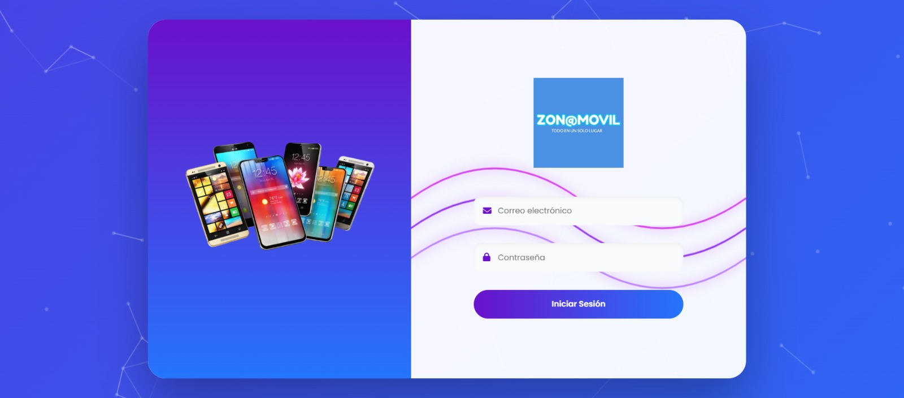
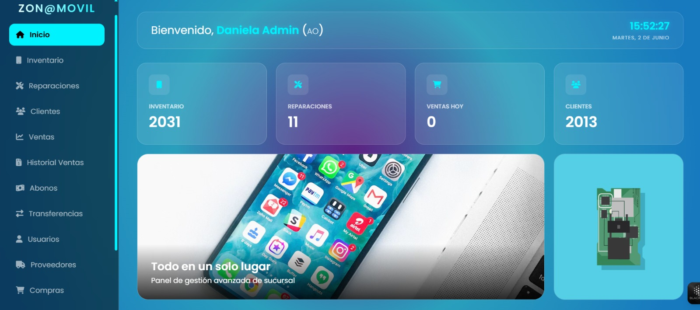
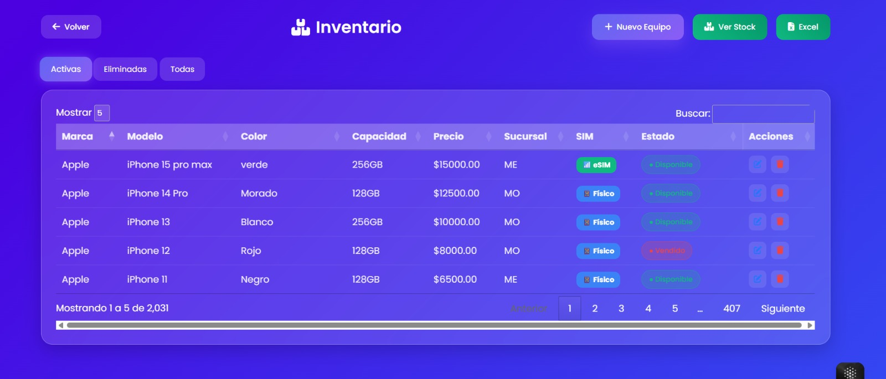
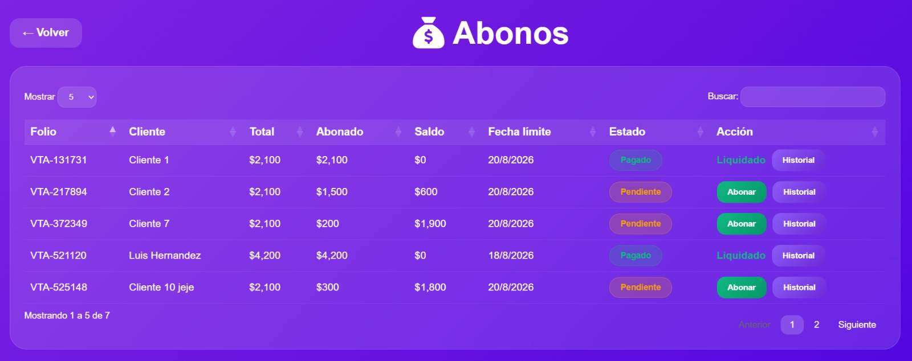
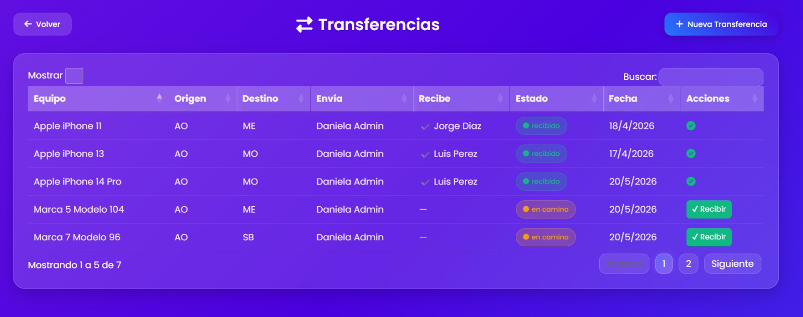

# ZonaMovil – Web Mobile Management System

ZonaMovil is a full-stack multi-branch management platform designed for inventory control, sales, repairs, customers, suppliers, payments, and business operations for mobile stores.

This project was developed as part of a university software engineering project.

---

## Features

- User authentication and login
- Dashboard with business statistics
- Inventory management system
- Sales management
- Repairs management
- Customer management
- Supplier management
- Payment management (Abonos)
- Transfers between branches
- Purchase management
- Role-based access control
- Responsive web interface

---

## Technologies Used

### Backend
- Node.js
- Express.js
- PostgreSQL
- JavaScript

### Frontend
- HTML
- CSS
- JavaScript

### Tools
- Git & GitHub
- VS Code
- Postman
- Ngrok

---

## Screenshots

### Login



### Dashboard



### Inventory Management



### Payment Management (Abonos)



### Branch Transfers



---

## Installation

Clone the repository:

```bash
git clone https://github.com/ingdani2901/zonamovil-web-mobile-system.git
```

Install dependencies:

```bash
npm install
```

Run the server:

```bash
node server.js
```

---

## Project Structure

```plaintext
src/
 ├── config/
 ├── controllers/
 ├── middlewares/
 ├── routes/
public/
server.js
package.json
```

---

## Notes

The mobile application connects to this backend API.

For external device testing, the backend was exposed using **Ngrok**.

---

## Author

**Daniela Sepúlveda Gómez**

Software Engineering Student
