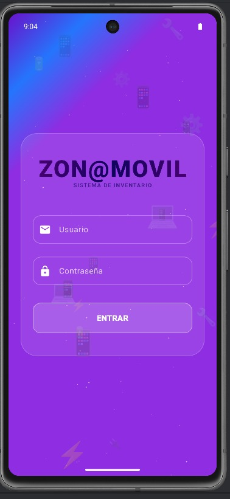
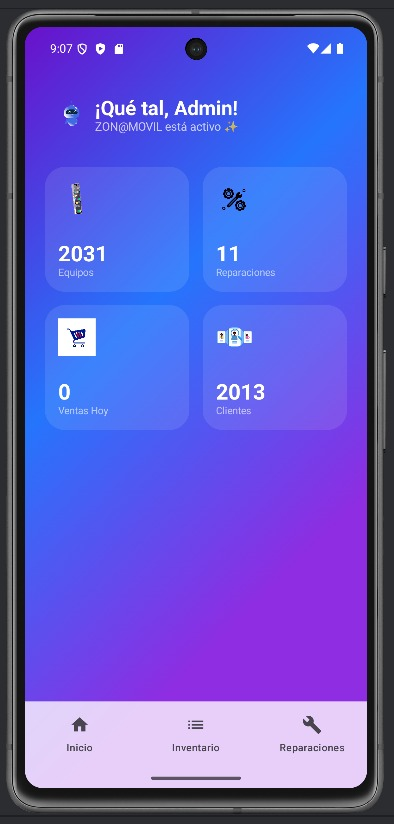

# ZonaMovil – Web Mobile Management System

ZonaMovil is a full-stack multi-branch management platform designed for inventory control, sales, repairs, customers, suppliers, and business operations for mobile stores.

This project was developed as part of a university software development project.

---

## Features

- User authentication and login
- Dashboard with business statistics
- Inventory management
- Sales management
- Repairs management
- Customer management
- Supplier management
- Transfers between branches
- Purchases and payments management
- Role-based access control
- Responsive web interface

---

## Technologies Used

### Frontend
- HTML
- CSS
- JavaScript

### Backend
- Node.js
- Express.js

### Database
- PostgreSQL

### Additional Tools
- Ngrok
- Git / GitHub

---

## Project Structure

```txt
public/
 ├── dashboard.html
 ├── inventario.html
 ├── ventas.html
 ├── reparaciones.html
 ├── clientes.html
 └── usuarios.html

src/
 ├── config/
 ├── controllers/
 ├── middlewares/
 └── routes/

server.js
package.json
```

---

## Screenshots

### Login Screen



### Dashboard Screen



---

## Installation

Clone the repository:

```bash
git clone https://github.com/ingdani2901/zonamovil-web-mobile-system.git
```

Install dependencies:

```bash
npm install
```

Run the server:

```bash
node server.js
```

---

## Notes

This project uses a local backend connection and was tested using **Ngrok** for mobile access across different networks.

---

## Author

**Daniela Sepúlveda Gómez**
